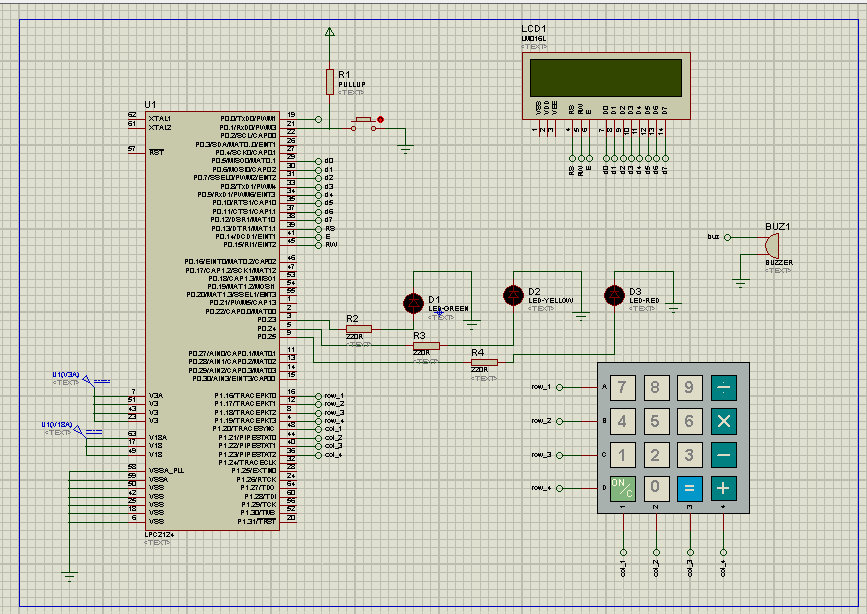

# 🚆 Smart Railway Platform Clock & Announcement Controller

<p align="center">
  <strong>LPC2148 ARM7 • Embedded C • RTC • 16×2 LCD • 4×4 Keypad • LEDs • Buzzer • EINT0</strong>
</p>

## 📌 Project Overview

The **Smart Railway Platform Clock & Announcement Controller** is an embedded railway platform information system developed using the **LPC2148 ARM7 microcontroller** and **Embedded C**.

The system combines a real-time clock, train scheduling, keypad-based data entry, LCD information display, train-status LEDs, buzzer alerts, and external interrupt functionality into a single embedded application.

The controller maintains the current time, processes scheduled train information, displays upcoming train details, indicates train status, and provides a menu-based interface for editing railway information.

---

## ✨ Features

- 🕐 RTC-based real-time clock
- 🚆 Multiple train schedule management
- 📺 16×2 LCD display
- ⌨️ 4×4 matrix keypad
- 🟢 Green LED — On Time
- 🟡 Yellow LED — Approaching
- 🔴 Red LED — Delayed
- 🔔 Buzzer alert
- ⚡ EINT0 external interrupt
- 📝 Menu-based schedule editing
- 🛤️ Platform information
- ⏱️ Arrival and departure time management
- ⏳ Delay information
- 💻 Modular Embedded C programming
- 🧪 Proteus simulation

---

# 🔌 Proteus Circuit Diagram

**Original project circuit diagram — included directly inside this README.**



---

# 🧠 System Architecture

```text
                         ┌─────────────────────┐
                         │      LPC2148        │
                         │      ARM7 MCU       │
                         └──────────┬──────────┘
                                    │
              ┌─────────────────────┼─────────────────────┐
              │                     │                     │
              ▼                     ▼                     ▼
        ┌──────────┐          ┌──────────┐          ┌──────────┐
        │   RTC    │          │  4×4     │          │ 16×2 LCD │
        │  Clock   │          │ Keypad   │          │ Display  │
        └──────────┘          └──────────┘          └──────────┘
              │                     │                     │
              └─────────────────────┼─────────────────────┘
                                    │
                                    ▼
                         ┌─────────────────────┐
                         │ Train Schedule &    │
                         │ Status Processing   │
                         └──────────┬──────────┘
                                    │
                    ┌───────────────┼───────────────┐
                    ▼               ▼               ▼
                🟢 GREEN        🟡 YELLOW        🔴 RED
                 ON TIME        APPROACHING      DELAYED
                                                    │
                                                    ▼
                                                🔔 BUZZER
```

---

# 🎯 Objectives

1. Develop a railway platform clock using LPC2148.
2. Display date and time using an RTC.
3. Maintain multiple train schedules.
4. Display upcoming train information.
5. Allow schedule information to be entered and edited using a keypad.
6. Indicate train status using LEDs.
7. Generate buzzer alerts.
8. Demonstrate external interrupt handling.
9. Practice modular Embedded C programming.
10. Integrate multiple peripherals into one embedded application.

---

# 🔧 Hardware Components

| Component | Purpose |
|---|---|
| **LPC2148** | Main ARM7 microcontroller |
| **16×2 LCD** | Displays railway information |
| **4×4 Matrix Keypad** | User input |
| **RTC** | Real-time clock |
| **Green LED** | On-time indication |
| **Yellow LED** | Approaching indication |
| **Red LED** | Delayed indication |
| **Buzzer** | Audible alert |
| Resistors | LED current limiting |
| 12 MHz Crystal | Microcontroller clock |
| Power Supply | Circuit power |

---

# 📍 Pin Configuration

| Module | LPC2148 Pin |
|---|---|
| LCD Data | P0.8 – P0.15 |
| LCD RS | P0.16 |
| LCD RW | P0.17 |
| LCD EN | P0.18 |
| Buzzer | P0.19 |
| Green LED | P0.23 |
| Yellow LED | P0.24 |
| Red LED | P0.25 |
| Keypad Rows | P1.16 – P1.19 |
| Keypad Columns | P1.20 – P1.23 |
| EINT0 | P0.1 |

> Pin assignments should be verified against the final source code and Proteus schematic.

---

# ⌨️ 4×4 Keypad

The keypad provides menu navigation and data-entry functionality.

```text
┌─────┬─────┬─────┬─────┐
│  7  │  8  │  9  │  B  │
├─────┼─────┼─────┼─────┤
│  4  │  5  │  6  │  /  │
├─────┼─────┼─────┼─────┤
│  1  │  2  │  3  │  -  │
├─────┼─────┼─────┼─────┤
│  C  │  0  │  E  │  +  │
└─────┴─────┴─────┴─────┘
```

| Key | Function |
|---|---|
| `B` | Backspace |
| `C` | Clear |
| `E` | Enter |
| `+ / -` | Navigation / value control |
| Numeric keys | Data entry |

---

# 🚆 Train Database

The current example database contains:

| Train No. | Train Name | Destination | Platform | Arrival | Departure |
|---:|---|---|---:|---:|---:|
| **12745** | Manugur SF Express | Manugur | 1 | 09:30 | 09:40 |
| **12723** | Telangana Express | Hazrat Nizamuddin | 2 | 10:30 | 10:40 |
| **12704** | Falaknuma Express | Vishakapatnam | 3 | 11:00 | 11:10 |

Example C structure:

```c
typedef struct
{
    u32 trainNo;
    char trainName[40];
    char destination[40];

    u8 platform;

    u8 arrHour;
    u8 arrMin;

    u8 depHour;
    u8 depMin;

    u16 delayMin;

    u8 status;

} TB;
```

---

# 📺 LCD Display

The 16×2 LCD is used for displaying railway information such as:

### Clock

```text
TIME 09:28:35
DATE 17-09-2026
```

### Train Information

```text
12745 MANUGUR SF
MANUGUR P1 09:30
```

### Status

```text
TRAIN APPROACH
PLATFORM 1
```

### Delay

```text
TRAIN DELAYED
DELAY: 15 MIN
```

---

# 🚦 Train Status

| LED | Status | Meaning |
|---|---|---|
| 🟢 Green | On Time | Train is according to schedule |
| 🟡 Yellow | Approaching | Train is close to its scheduled event |
| 🔴 Red | Delayed | Train has a delay |

The buzzer can provide an additional audible alert.

---

# 🕐 RTC Operation

```text
             RTC
              │
              ▼
        Current Time
              │
              ▼
       Train Schedule
              │
              ▼
       Time Comparison
              │
       ┌──────┼──────┐
       ▼      ▼      ▼
    ON TIME  NEAR   DELAYED
       │      │       │
       ▼      ▼       ▼
     GREEN  YELLOW    RED
                      +
                    BUZZER
```

---

# 📝 Menu & Schedule Editing

The keypad can be used to access the menu and edit railway information.

```text
== MAIN MENU ==

1. Edit RTC Time
2. Edit Train Time
3. Edit Arrival Time
4. Edit Departure Time
5. Edit Delay
6. Edit Platform
```

---

# ⚡ External Interrupt

**EINT0** is used as an external interrupt input for triggering the editing request.

```text
External Input
      │
      ▼
    EINT0
      │
      ▼
Interrupt Service Routine
      │
      ▼
 Edit Request
      │
      ▼
 Menu / Schedule Editing
```

---

# 🔔 Buzzer

The buzzer provides an audible indication for important train events, such as approaching or delayed trains.

---

# 💻 Software & Development Tools

| Tool / Technology | Usage |
|---|---|
| **LPC2148 ARM7TDMI-S** | Microcontroller |
| **Embedded C** | Programming |
| **Keil µVision** | IDE / Compiler |
| **Proteus** | Circuit simulation |
| **Git / GitHub** | Version control |

---

# 🗂️ Suggested Project Structure

```text
Smart-Railway-Platform-Clock/
│
├── main.c
├── lcd.c
├── lcd.h
├── lcd_defines.h
├── project_kpm.c
├── project_kpm.h
├── rtc.c
├── rtc.h
├── delay.c
├── delay.h
├── menu.c
├── menu.h
├── train_db.c
├── train_db.h
├── train_info_display.c
├── train_info_display.h
├── project_led.c
├── project_led.h
├── buzzer.c
├── buzzer.h
├── eint0_interrupt.c
├── eint0_interrupt.h
├── types.h
├── defines.h
└── README.md
```

---

# 🔄 Overall Working

```text
START
  │
  ▼
Initialize LPC2148
  │
  ├── LCD
  ├── RTC
  ├── Keypad
  ├── LEDs
  ├── Buzzer
  └── EINT0
  │
  ▼
Read Current RTC Time
  │
  ▼
Process Train Schedule
  │
  ▼
Compare Current Time
with Train Schedule
  │
  ├──────────────┬───────────────┐
  ▼              ▼               ▼
ON TIME       APPROACHING      DELAYED
  │              │               │
  ▼              ▼               ▼
GREEN          YELLOW            RED
LED              LED              LED
                                  │
                                  ▼
                                BUZZER
  │
  ▼
Display Train Information
  │
  ▼
Check Keypad / EINT0
  │
  ▼
Edit Information if Required
  │
  ▼
Repeat
```

---

# 🧪 Proteus Simulation

The project can be simulated in Proteus using:

- LPC2148
- 16×2 LCD
- 4×4 matrix keypad
- RTC
- Green LED
- Yellow LED
- Red LED
- Buzzer
- Resistors
- Crystal oscillator
- Reset and power connections

The compiled Keil HEX file can be loaded into the LPC2148 Proteus model.

---

# 📚 Concepts Demonstrated

- ARM7 LPC2148 architecture
- Embedded C
- GPIO programming
- LCD interfacing
- Matrix keypad scanning
- RTC
- External interrupts
- VIC interrupt controller
- Structures
- Arrays
- Modular programming
- Time comparison
- Train-status management
- Peripheral integration
- Proteus simulation
- Embedded-system debugging

---

# 🚀 Future Enhancements

- 📢 Voice-based railway announcements
- 📡 GSM-based train notifications
- 🌐 IoT-based remote schedule updates
- 📱 Mobile application integration
- 💾 EEPROM/Flash-based train storage
- 🖥️ Graphical LCD/TFT display
- 🔊 Pre-recorded voice announcements
- 🛰️ GPS-based train tracking
- 🔄 Automatic railway schedule synchronization
- 🛤️ Multiple-platform support

---

# 📊 Project Status

**🚧 Embedded Systems Prototype**

The project integrates the railway clock, train database, LCD, keypad, LED status indication, buzzer, menu system, and external interrupt functionality as an academic embedded-systems project.

---

# 👨‍💻 Project Highlights

**Hardware:** LPC2148 ARM7 + RTC + 16×2 LCD + 4×4 Keypad + LEDs + Buzzer

**Software:** Embedded C + Keil µVision

**Simulation:** Proteus

**Application:** Railway Platform Information & Announcement Controller

---

# ⭐ Conclusion

The **Smart Railway Platform Clock & Announcement Controller** demonstrates the integration of multiple embedded peripherals into a practical railway information prototype.

The project combines **real-time clock management, train scheduling, keypad input, LCD display, LED status indication, buzzer alerts, and interrupt handling** in a modular Embedded C application.

---

## 📄 License

This project is intended for **educational and learning purposes**.

Feel free to study, modify, and extend the project for your own embedded-systems experiments.

---

<p align="center">
  🚆 <strong>Smart Railway Platform Clock & Announcement Controller</strong><br>
  <sub>LPC2148 ARM7 • Embedded C • RTC • LCD • Keypad • LEDs • Buzzer • Interrupts • Proteus</sub>
</p>
